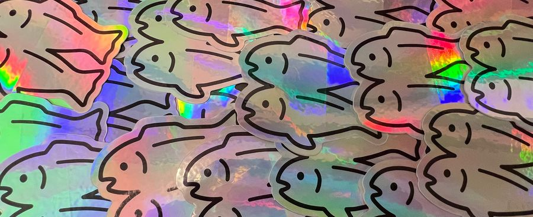
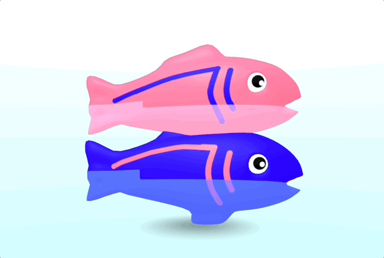

# A pictures website

A daft site with some images in it! When you deploy to Fastly and apply Image Optimizer, the before and after pics will be different...

* You can see the origin site at: [glitchdotcom.github.io/pics-site](https://glitchdotcom.github.io/pics-site)
* And an example of a Fastly deployed, image optimized version at: [github-pics.global.ssl.fastly.net/pics-site](https://github-pics.global.ssl.fastly.net/pics-site)

| Before  | After |
| ------------- | ------------- |
|   |   |
|   |    |
|  |  |
|  |  |

With the Fastly version of the site open, use your browser dev tools to try different parameters on the image elements.

## Clone your own to try Fastly

You can make your own version of this site and add more pics to try with Fastly Image Optimizer:

* Clone the repo
* In your repo **Settings** select **Pages**
* Choose **Deploy from branch** and select the `main` branch
* **Save** and GitHub will publish your site
* Grab the address which will end `github.io`

[Create a Fastly service with your new website as its origin and try Image Optimizer on it!](https://docs.fastly.com/en/guides/about-fastly-image-optimizer)
